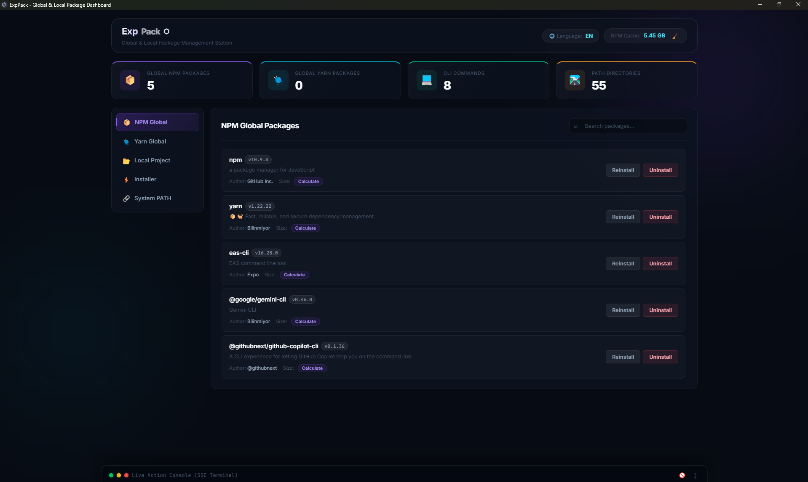

# ExpPack 🚀

ExpPack; bilgisayarınızdaki global ve yerel **NPM**, **Yarn** ve **NPX** paketlerini tespit eden, bunların diskteki konumlarını gösteren, silen, yeniden yükleyen ve sistem **PATH** değişkeni ile **Önbellek (Cache)** yönetimini kolayca yapmanızı sağlayan modern bir masaüstü kontrol paneli uygulamasıdır.

Hafif (lightweight) yapısı sayesinde bilgisayarınızda fazladan bellek tüketmez, saniyeler içinde açılır ve işlerinizi hızlandırır.



---

## ✨ Özellikler

* **📦 Global Paket Tarayıcı:** Global yüklü NPM ve Yarn paketlerini, versiyonlarını, disk boyutlarını ve hangi CLI komutlarını (örn: `cmd: cline`, `cmd: gemini`) terminale tanımladıklarını listeler.
* **📂 Yerel Proje Tarayıcı:** Bilgisayarınızdaki herhangi bir Node.js projesinin dizinini girerek o projeye ait `package.json` bağımlılıklarını ve yerel `node_modules` klasörünü arayüz üzerinden analiz edebilirsiniz.
* **⚡ Akıllı Paket Yükleyici:** İster sadece paket adını girin (Örn: `typescript`), ister kopyaladığınız hazır komutu yapıştırın (Örn: `npm install -g @google/clasp`), ExpPack komutu otomatik ayrıştırarak en uygun yöneticide yüklemeyi başlatır.
* **🖥️ Canlı Terminal (SSE Console):** Yapılan tüm paket yükleme, kaldırma veya güncelleme işlemlerinin terminal çıktılarını arayüzdeki simüle edilmiş konsolda anlık olarak (Server-Sent Events ile) gösterir.
* **🛣️ Sistem PATH Yönetimi:** Sistem ortam değişkenlerindeki (PATH) yolları listeler (Node/npm/yarn yollarını yeşil vurgular) ve tek tıkla Kullanıcı PATH değişkenine yeni bir klasör eklemenizi sağlar.
* **🧹 Önbellek (Cache) Kontrolü:** NPM önbellek boyutunu hesaplar ve tek tıkla temizleme (`npm cache clean --force`) imkanı sunar.

---

## 🛠️ Teknolojiler

* **Masaüstü Katmanı:** [Electron](https://www.electronjs.org/)
* **Sunucu Katmanı:** [Node.js](https://nodejs.org/) & [Express](https://expressjs.com/) (REST APIs & Server-Sent Events)
* **Arayüz (UI):** HTML5, Vanilla JavaScript, Custom CSS3 (Premium Karanlık Mod, Glassmorphism, Neon Glow efektleri ve mikrosaniye animasyonlar)

---

## 🚀 Çalıştırma ve Geliştirme

Projeyi çalıştırmadan önce Node.js ve npm'in bilgisayarınızda kurulu olduğundan emin olun.

1. Proje bağımlılıklarını yükleyin:
   ```bash
   npm install
   ```

2. Uygulamayı **Geliştirici Modunda (Electron Arayüzü)** başlatın:
   ```bash
   npm start
   ```

3. Uygulamayı sadece **Web Sunucusu** olarak başlatıp tarayıcıdan (`http://localhost:4200`) bağlanmak için:
   ```bash
   npm run server
   ```

---

## 📦 Dağıtım ve Paketleme

Uygulamayı harici bilgisayarlarda doğrudan çift tıklayarak çalışacak şekilde paketlemek isterseniz:

1. Aşağıdaki komutu çalıştırın (electron-builder derlemeyi başlatacaktır):
   ```bash
   npm run dist
   ```

2. Derleme tamamlandığında bağımsız Windows uygulamaları `dist/` klasöründe oluşacaktır:
   * **`dist/ExpPack 1.0.0.exe`**: Portable (Taşınabilir) sürüm. Kurulum gerektirmez, doğrudan çalışır.
   * **`dist/ExpPack Setup 1.0.0.exe`**: Windows için standart kurulum sihirbazı.

---

## 📄 Lisans

Bu proje **MIT** lisansı ile lisanslanmıştır.
